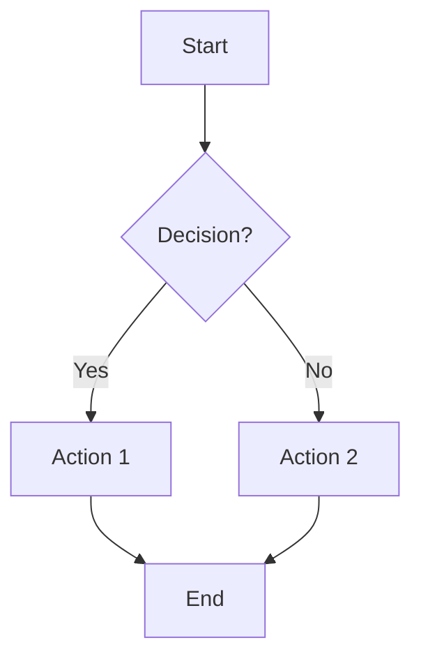
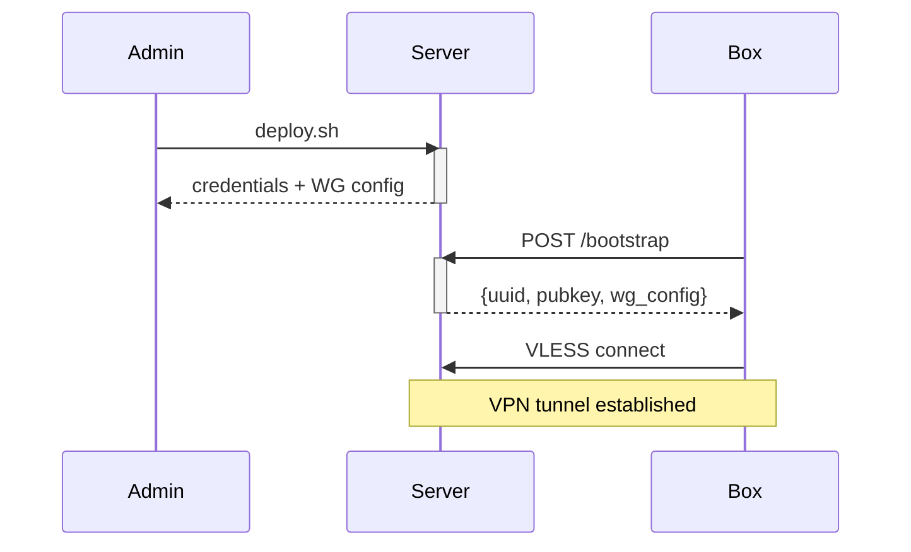
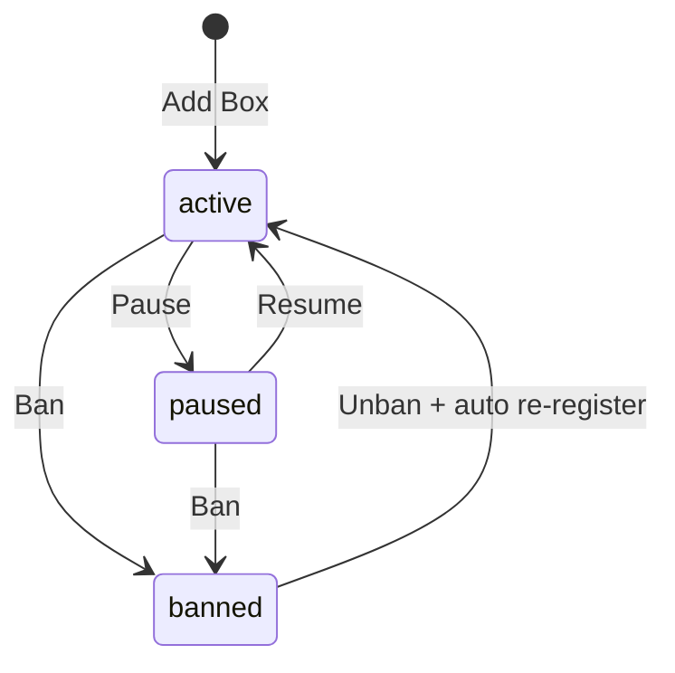
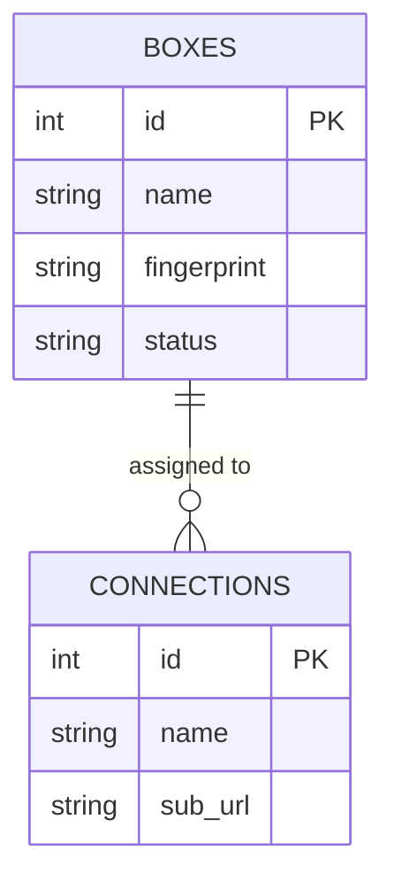
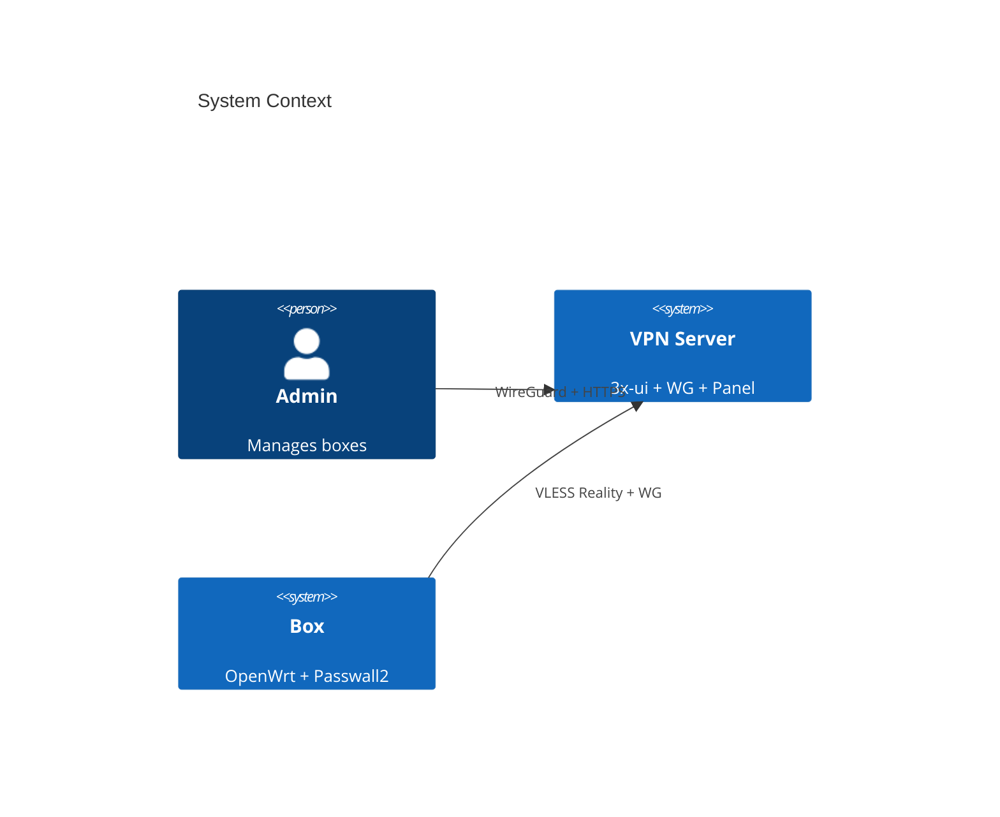
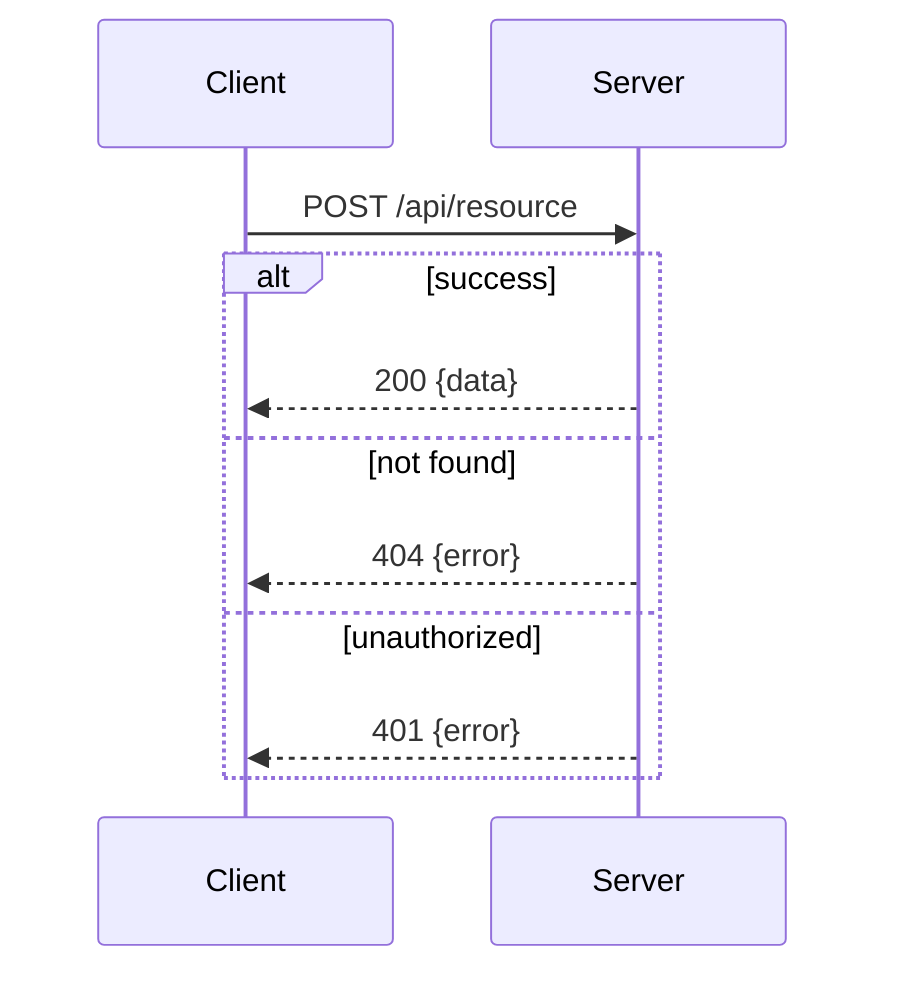
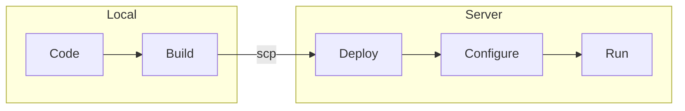
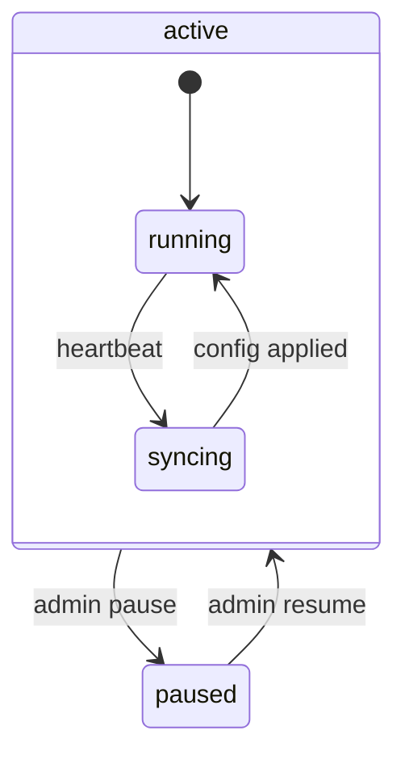

# Mermaid Diagrams

Generate clean, well-structured Mermaid diagrams that render correctly in GitHub, GitLab, VSCode, and other markdown renderers.

## Choosing the right diagram type

Pick the type that best communicates the idea. Here's a quick guide:

| User wants to show | Diagram type | When to use |
|---|---|---|
| Step-by-step process | `flowchart` | Decisions, branching logic, workflows |
| Who talks to whom, in order | `sequenceDiagram` | API calls, protocols, request/response flows |
| System states and transitions | `stateDiagram-v2` | Lifecycle, status machines (active/paused/banned) |
| System components and relationships | `C4Context` or `flowchart` | Architecture overview, service dependencies |
| Database schema | `erDiagram` | Tables, relationships, data models |
| Timeline / schedule | `gantt` | Project planning, phases |
| Class hierarchy | `classDiagram` | OOP design, interfaces |
| Git branching | `gitgraph` | Release strategy, branching model |

If unsure, default to `flowchart` for processes and `sequenceDiagram` for interactions.

## Syntax guidelines

### Flowchart



Key points:
- `TD` = top-down, `LR` = left-right. Use LR for wide diagrams, TD for tall ones.
- Node shapes: `[rectangle]`, `{diamond/decision}`, `([stadium])`, `((circle))`, `[/parallelogram/]`
- Subgraphs group related nodes: `subgraph Title ... end`
- Keep labels short — long text breaks layout
- `\n` does NOT work in node labels — keep labels on one line
- Avoid special characters inside `[]` labels: `:`, `/`, `()` can break parsing. Keep labels simple: `A[My Node]`
- `<-->` bidirectional arrows don't work in all renderers — use `-->` only
- `---` invisible links can cause issues — use `~~~` for spacing
- `-.-` for dotted lines
- Subgraph labels with parentheses break: `subgraph Name[Label Text]` without `()`
- Cyrillic works but test in target renderer

### Sequence Diagram



Key points:
- `participant X as Label` for readable names
- `->>` solid arrow (request), `-->>` dashed (response)
- `activate`/`deactivate` for lifelines
- `Note over X,Y: text` for annotations
- `loop`, `alt`/`else`, `opt` for control flow
- `rect rgb(...)` for highlighting sections

### State Diagram



### Entity Relationship



### C4 Context (architecture)



## Style and readability

### Keep it clean
- 15-20 nodes max per diagram. Split complex systems into multiple diagrams.
- Use subgraphs to group related components.
- Label edges — unlabeled arrows are ambiguous.
- Consistent naming: either all lowercase-with-dashes or all CamelCase, not mixed.

### Make it fit the context
- For README/docs: simpler diagrams, fewer details, focus on the "what"
- For SPEC: detailed diagrams with all interactions, focus on the "how"
- For debugging: sequence diagrams showing exact request/response flow

### Color and styling (when needed)


Use sparingly — colors should highlight important distinctions (public vs private, success vs error), not decorate.

## Common patterns

### Request/response with error handling



### Deployment pipeline



### State machine with actions



## Outputting diagrams

Place diagrams in fenced code blocks with the `mermaid` language tag:

````

````

When adding to existing documents:
- Place diagrams near the text they illustrate
- Add a brief description before the diagram explaining what it shows
- Don't replace text explanations with diagrams — use both

## Validation checklist

Before outputting, mentally verify:
- All node IDs are unique
- All referenced nodes exist (no broken arrows)
- No unescaped special characters in labels (quotes, brackets)
- Diagram renders at a reasonable size (not too wide/tall)
- Labels are concise (< 40 chars)
